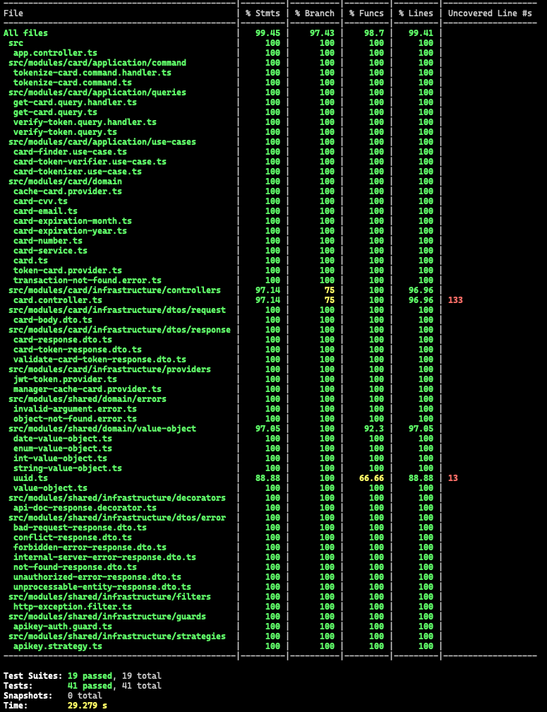

# Tokenizer
<p align="center">
  <a href="http://nestjs.com/" target="blank"></a>
</p>

<p align="center">
  <a href="#" target="_blank"></a>
  <a href="#" target="_blank"></a>
  <a href="#" target="_blank"></a>
</p>

## Description
<p>
  Tokenizer microservice with hexagonal architecture, developed using Nest and documented with OpenAPI
</p>

## Running the app in local with Kubernetes (minikube)
1. Clone the project
2. Navigate to the project folder, for example ```cd tokenizer```
3. Create de redis resource:
```bash
$ kubectl apply -f etc/kubernetes/redis-deployment.yaml
$ kubectl apply -f etc/kubernetes/redis-service.yaml
```

4. Deploy and expose the tokenizer app:
```bash
$ kubectl apply -f etc/kubernetes/tokenizer-deployment.yaml
$ kubectl apply -f etc/kubernetes/tokenizer-service.yaml
```

5. Redirect tokenizer app traffic to localhost:
```bash
$ kubectl port-forward svc/app-tokenizer-service 3000:8080
```

6. Test the app. The `apikey` is required in the header, for example: `x-api-key: pk_test_LsRBKejzCOEEWOsw`. You can import the Postman collection located at `etc/postman` for this purpose.


## Running the app in local
1. Clone the project
2. Install dependencies
```bash
$ npm install
```
3. Run docker file to get Redis up locally
```bash
$ docker-compose up -d
```
4. Clone the file ```.env.example``` and rename it to ```.env```, edit the new file if necessary
5. Build the app 
```bash
$ npm run build
```
6. Run the app
```bash
$ node dist/main
```


7. Test the app. The `apikey` is required in the header, for example: `x-api-key: pk_test_LsRBKejzCOEEWOsw`. You can import the Postman collection located at `etc/postman` for this purpose.

## Tests
<p>
  This microservice has unit tests and e2e tests
</p>

```bash
# run all tests
$ npm run test

# unit tests
$ npm run test:unit

# e2e tests
$ npm run test:e2e
```

## Coverage
<p>
  This microservice has a coverage greater than 95%
</p>

```bash
# test coverage
$ npm run test:cov
```



## Documentation
<p>
  All endpoints documented using OpenAPI
</p>

Go to ```http://{aplication_url}/docs``` for example ```http://localhost:3000/docs```


## License
[AGPL licensed](LICENSE).
